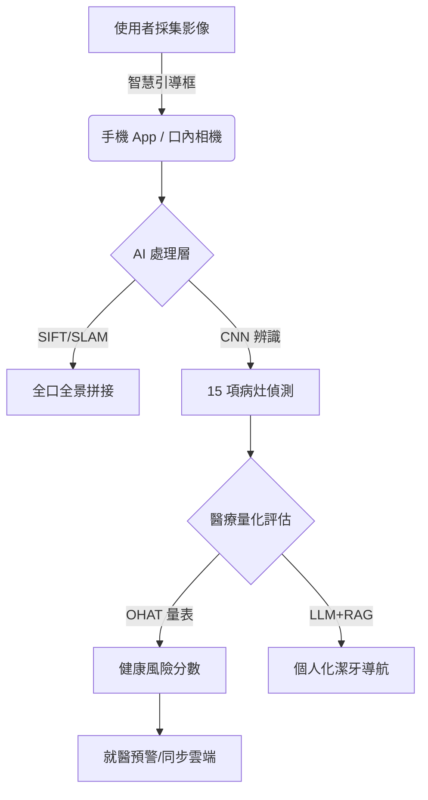

# 🦷 牙視界 (OralVision)：居家 AI 口腔影像分析系統
> **「預防勝於治療」—— 填補 180 天的數據斷層，守護國人 8020 健康計畫。**

## 🌟 專案願景
本專案開發一套結合 **深度學習 (Deep Learning)**、**IoT 雲端同步**與 **LLM+RAG 智慧導航**的口腔監測生態系。我們致力於將專業的臨床診斷轉換為全民皆可負擔的居家預防工具，解決台灣 42.8% 齲齒未治療率的社會痛點。透過 AI 的視覺化賦能，我們讓隱形病灶「無所遁形」，推動全民從反應性治療轉向主動性預防管理。

---

## 🔍 深度背景：為何我們需要「牙視界」？

### 📌 被忽視的全民危機
根據衛福部最新調查，台灣成人齲齒盛行率高達 **98.6%**，平均每人有 **14 顆** 齲齒經驗。然而，高達 **42.8%** 的病灶處於「未治療」狀態，這主要源於初期病灶的「無痛感」特性，導致民眾容易延誤黃金治療期。

### 📌 全身健康的連鎖反應
口腔疾病與**心血管疾病、糖尿病、吸入性肺炎**甚至與**失智症**有密切關聯。維持口腔健康不僅是為了美觀，更是護衛整體壽命餘命的關鍵防線。

---

## 🏗️ 系統核心架構 (System Architecture)

### 🔹 A. 硬體與採集層 (Data Collection)
*   **智慧影像採集**：配備輔助光源的高清口內鏡頭，結合 App 「智慧引導框」，輔助使用者精準捕捉後牙、智齒等視覺死角。
*   **非侵入性測量**：完全取代傳統探針檢查，降低病患對醫療器械的心理壓力。

### 🔹 B. 算力與辨識層 (Processing & Recognition)
*   **CNN 像素級辨識**：應用卷積神經網路偵測包含早期去礦化、牙結石、口腔潰瘍（破斑硬突腫）等核心特徵。
*   **SIFT/SLAM 拼接**：將多張局部照片縫合成完整的「數位全口地圖」，填補診間之外的數據真空期。

### 🔹 C. 導航與交互層 (Interaction & Guidance)
*   **LLM+RAG 智慧導航**：系統掛載專業《成人口腔保健手冊》知識庫，利用檢索增強生成技術產出醫學規範的潔牙建議。
*   **OpenSpec 規格驅動**：專案遵循 **OpenSpec** 規範定義系統接口與開發標準，確保後續擴展性與穩定性。

---

## 🤖 AI 全方位 15 項辨識指標

| 類別 | 監測項目 |
| :--- | :--- |
| **牙齒硬組織** | 齲齒 (初/中/深期)、智齒發育、牙齒酸蝕、齒色變異、牙齒歪斜 (矯正建議)。 |
| **牙周軟組織** | 牙結石堆積、牙齦紅腫、牙齦萎縮、疑似膿包、口腔潰瘍 (破、斑、硬、突、腫)。 |
| **衛生與環境** | 食物殘渣、舌苔厚度、牙菌斑評估、牙周病風險評估、口腔黏膜異常。 |

---

## 📝 專案檔案清單 (Project Documentation)
*   📄 **[產品規格書.md](./產品規格書.md)**：包含詳細實驗指標 (mAP@0.5: 0.85) 與系統底層邏輯。
*   📄 **[相關研究.md](./相關研究.md)**：彙整歷年調查與技術演進，提供全維度對比表格。
*   🎤 **[口頭報告講稿.md](./口頭報告講稿.md)**：結構化、專業美編後的演講逐字稿。
*   📜 **[對話紀錄.txt](./對話紀錄.txt)**：一字不漏的開發歷程與技術決策記錄。
*   📂 **[口腔影像分析.pdf](./口腔影像分析.pdf)**：視覺化簡報檔，含關鍵統計圖表與全身健康關聯圖。

---

## 👥 團隊成員 (Team 9)
*   **劉禹彤** (4112056006)
*   **黃喻琦** (4112056032)
*   **廖沛昀** (4112056033)

---
*最後更新日期：2026 年 4 月 21 日*  
*資料來源：衛福部 110-112 年人口腔健康調查、WHO 全球口腔健康目標 2030*
Template: OpenSpec Spec-Driven Development
